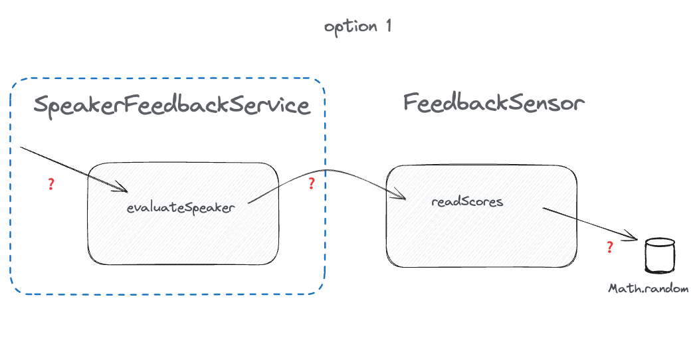
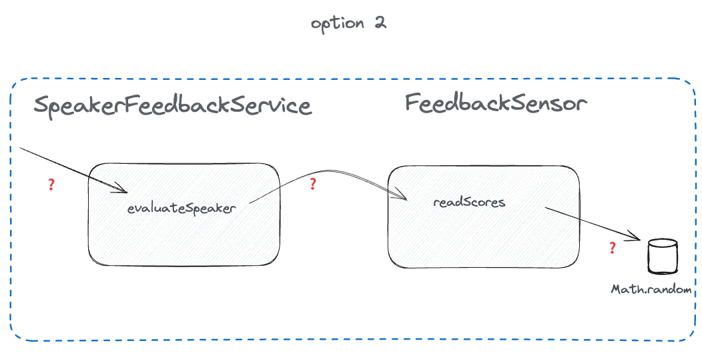
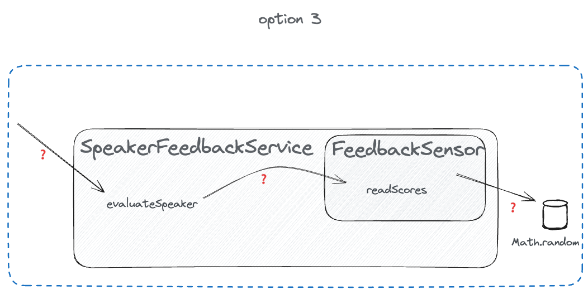

# Finding seams, speaker-feedback.md

[..go back](./README.md)

## Step 1 **Test SpeakerFeedbackService#evaluateSpeaker**

**Background**: Speaker feedback system.

Your job is to cover `SpeakerFeedbackService#evaluateSpeaker` with tests, because you'll have a 
change requirement on this part of the code. Your job is to **touch only `SpeakerFeedbackService`** 
and make that test never to fail.

**Task**: Make Feedback Service Test not failing randomly 

1. Run `1-speaker-feedback.test` for a few times. See it randomly fail
2. Identify what is the difficult part in making this fail.
3. Plan on how to test it:
   - Is the message incoming query or command?
   - Does the method have outgoing queries / commands?
   - Is there private methods involved?
4. How would you change the shape of SpeakerFeedbackService to introduce a seam?

**Notes**

- Math.Random is used to simulate a data in DB. It provides random amount of evaluations between 1..5.
- How would you draw the design of the relevant classes? In the drawings below, the 'imaging a box around the unit' is
the blue box. Which of the drawings matches the reality the most? There is no right/wrong answer, just different
context and thinking.

 or

 or

 or

- For me, the second drawing is the most accurate. It shows that there are 2 separate classes (in the third, the 
`FeedbackSensor` is internal class to the `SpeakerFeedbackService`), but in order to test the `SpeakerFeedbackService`,
on needs to imagine the box around both classes.

- To make `SpeakerFeedbackService#evaluateSpeaker` trivial to test, if we can make the drawing to be more like the first,
we'd be very close to knowing on how to test the method.

**Acceptance Criteria:**

- The code is tested, and it's subsequently always green.

**Conclusions**:
- What was it that made this function hard to test?
- Do you see similar issues in your production code?
- What did you learn? How could you try this in prod code?

## Finished?

[Badge Printing](./2-task-badge-printing.md)


**Solution**

Spoiler alert! This will share the solution.

One way to solve this, is to use a 'peel' pattern from 'Peel and Slice' refactoring pattern. The peel, means that you
move the 'hard to test' parts


   ``` javascript
   // Initialize Scheduler
   const scheduler = new Scheduler();
   
   // Set custom sessions
   scheduler.setSessions([
     { duration: 45, max: 3 },
     { duration: 20, max: 5 },
     { duration: 10, max: 10 }
   ]);
   
   // Test the method.
   ```


