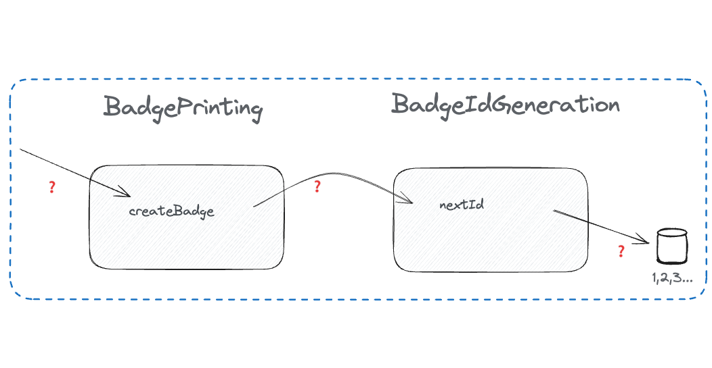
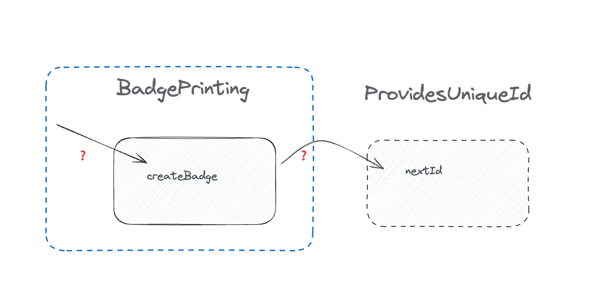

# Finding seams, speaker-feedback.md

[..go back](./2-task-badge-printing.md)

## Step 2 **Test BadgePrinting#createBadge**

**Background**: Printing Badges

For conference attendee, having a conference badge does have many purposes (which we don't focus on now). For printing
badges for participants, we have created a system where we can create a badge with unique Id for every attendee, and
as way to print it. It all happens to be in the same class. Lately we have seen an urge to improve on our test 
coverage metrics and we thought this was an easy win, but little did we know that the tests we wrote ended up being
dependent on the test run of the previous tests. This is a slippery slope ⛷️ to not trusting our tests, or getting 
into the 'retry loop' 🔄 of rerunning pipelines until all tests are green.

**Task**: Make `2-badge-printer.test` tests to pass regardless of the execution order of the tests.

1. Run the test for a few times. See it always passing.
2. Mark the first test as skipped, run all tests -> see a test failing.

3. Identify what is the difficult part in making this fail.
4. Plan on how to test it:
   - Is the message incoming query or command?
   - Does the method have outgoing queries / commands?
   - Is there private methods involved?
5. Where do you see an option for a seam?
   - No, this time **constructor injection is not allowed** (we'd do that in production code, as we did earlier. No
   we're learning 2 other tricks.)

**Notes**

- We know how to visualise the current situation, it looks familiar. We also know that if we only could imagine the box
only around `BadgePrinting`. But the `BadgeIdGeneration` just looks so so hard-coded.

Introducing shapes. Yeah. Literally. Shapes. Don't think about classes, interfaces - nothing concrete. Imagine a shape.
Something that has something to grasp on. A tiny corner here, a small dent there. Visualise this in your mind. 

Now imagine yourself as the `BadgePrinting` and you know you have a friend. The friend has a shape. It has tiny 
corners here, small dents there. You happen to know, that the friend knows how to answer to a message you are sending
to it. You know, that your friend knows how to handle an incoming query 'nextId' - and it returns a type that matches
the contract you, and your friend have been agreeing on.

This shape. This is us trusting our collaborators. This is us sending messages to our friends and trusting they know
how to deal with that. Now give that shape a name. Give it a name of the 'role that it plays'. Yeah. A role in a play.
So abstract, but it is. Make it abstrat in your mind, and the elements of OO suddenly makes sense. Elements of 
'sending and receiving messages'. Because that's what OO is about. Sending and receiving messages. And shapes.

**Acceptance Criteria:**

- The code is tested,
- BadgePrinting constructor arguments have not been modified
- you don't use a mocking library to mock the whole file of 'badge-id-generation.js' (yeah, looking at you, Jest -
  well, you can do this with sinon, too)

**Conclusions**:
- How would you describe a shape? 
- How would a shape be a useful metaphor for your situation?

## Finished?

[Room Availability](./3-room-availability.md)