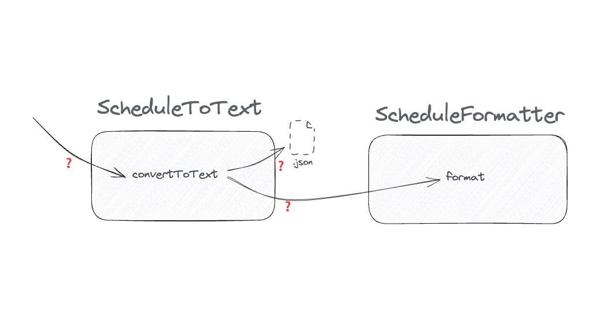
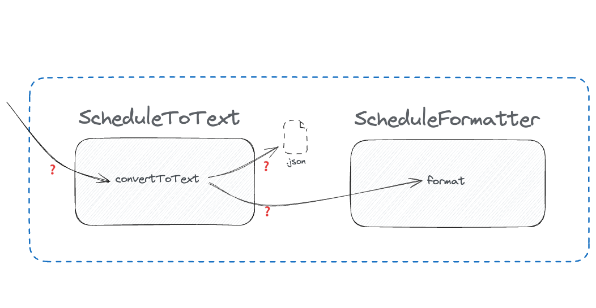
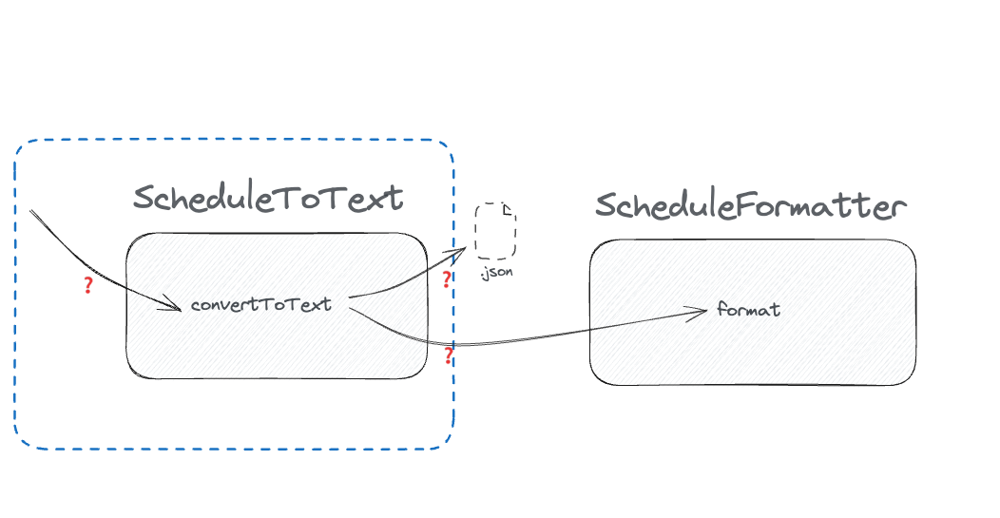
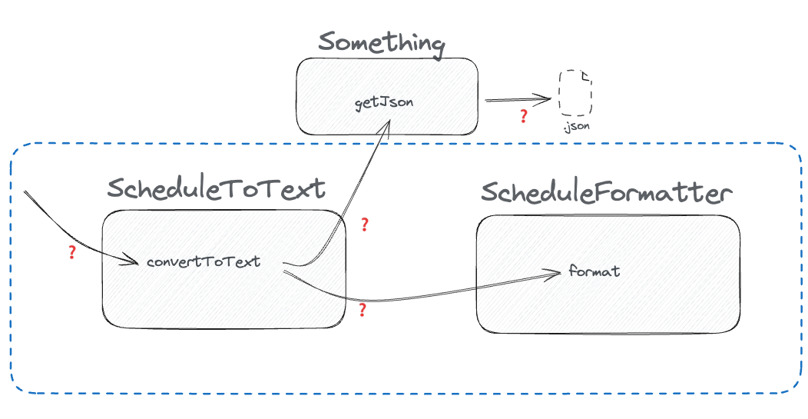

# Finding seams – Schedule Formatter

[..go back](./README.md)

## Step 3 **Test ScheduleConverter#convertToText**

**Background**: The conference needed a web page — and a printed flyer just won't do it any more.

We thought it was enought to print a flyer and to share that to the conference attendees. The thing that 
worked 2009 does not seem to cut it anymore. Now we need a web page for that. Lucky for us, we have all the
relevant data in JSON format, and it should be easy to make a small change so that we can both print a flyer
(we still believe in flyers) and to show the data in our web pages with responsive design.

The code that works - and provides value for us does first read the schedule from a JSON file, (lucky us,
we did store everything in a JSON for easy programmatic access), and then creates a conference program of
selected types and filters.

**Task**: In order to change the code to support HTML, we want to cover 'schedule-to-text' with tests, 
so that we can do the safe refactorings.

1. Run the tests, see how it fails. You will need to modify this test case later to make it pass, but 
   do it so that you don't modify the expectations, but the setup.
2. Go to the code, find out what makes the class difficult to test. Imagine a box. And use that as
   your thinking tool. What's inside the box?
3. Figure out how to inject dependenc(y/ies). 
   - maybe similarly as in [Badge Printing](./2-task-badge-printing.md), extracting a shape and using a 
     [Slide Statement](https://refactoring.com/catalog/slideStatements.html) to move the shape at the top?
   - but here, think of another way. If variables are initialized far away from their usage, that's another 
     code smell. So, try to find another way of introducing a seam.
4. Write tests that exercise:
   - you inject the json content into `Something` that gets it to the system under test
   - you can add a few test cases to cover some scenarios (incl. sorting)

**Notes**

Looks familiar, right? We have boxes, and arrows. We have 2 classes, many queries. How was it, to test anything?

1. Imagine a box around the unit
2. draw arrows (they are already done)
3. ask questions.

So, let's do it. Your turn to draw some boxes. What would it mean, from testability perspective, if the 
boxes were drawn like this:

It does not make the test easier - because what's happening inside the box, we don't care. And reading from a file
happens now to be inside the box. So we need to draw a bit different kinf of box. How about this: How is this
for a test

Sure, the `ScheduleToText` class is easy to test, but is this really the unit we want to test? Does this cover
the _wholeness_ of the algorithm. Surely, in the strictes of unit-test thinking, every class should be tested
individually, but this is not very pragmatic approach. And when adding tests for a safety net for refactoring, 
there is a high chance that the tests becomes brittle and does only harden the current implementation, meaning
that tests make evolutionary design more difficult than it needs to be. 

But we do know, that that JSON reading is the problem. That we want to get outside of the box. But the 
`ScheduleFormatter`? Can it just be within the box, and thought as **message sent to self**? Possibly. 
How do we do this, then? Remember 

> Extract Something somewhere!

And then the boxes could look like

How do you do that? With minimal changes?

**Acceptance Criteria:**

- `convertToText` is covered by tests that run without touching the file system.
- The tests are independent — no shared mutable state, no ordering dependency.
- You have not changed the constructor of `ScheduleConverter`.
- You have not used a module-mocking library (`jest`, `sinon`) to replace `fs` or `readFile`.

**Conclusions**:

- What made the JSON retrieval hard to test? 
- A this kind of seam relies on different dependency injection than previously. How does that differ from the *shape* metaphor from
  Step 2? Is this better or worse?
- If you had to use this class across many tests, would you keep the subclass approach, or
  would you eventually refactor toward one of the other injection styles?

## Finished?

[Reminder-Sender](6-reminder-sender.md)
