# How to use README.md and learning-log.md

Each weekly step in `step-N/` follows **Training from the Back of the Room (TBR)** - adapted for **solo, async** work. 
You move through the same four phases in every step:

| Phase                    | What it is for                                                                                         |
|--------------------------|--------------------------------------------------------------------------------------------------------|
| **Learning Goal**        | What is the learning goal for this exercise. Should be actionable.                                     |
| **1) Connections**       | Warm up: link the topic to what you already know, guess before reading, bridge from the previous step. |
| **2) Concepts**          | Read the ideas, diagrams, and vocabulary for this week.                                                |
| **3) Concrete practice** | Build or change code; check off deliverables in the README.                                            |
| **4) Conclusions**       | Reflect, loop back to your earlier guesses, write a key takeaway.                                      |

Two files carry that rhythm. **You alternate between them** - the README tells you *what to do*; the learning log is *where you write*.

---

## The two files

### `step-N/README.md` - your guide

- Learning goal and constraints for the week
- **Teaching content** (explanations, code samples, diagrams)
- Often starting with a `getting-started.md` to make sure you have the right environment
- Numbered instructions for each 4C phase
- Links **into** `learning-log.md` at the exact prompt to fill in (often with `#anchors`)
- Concrete-practice checklist (files to create, behaviour to demonstrate)
- Tips and optional extras

**Start here** when you open a new step.

### `step-N/learning-log.md` - your workbook

- Short prompts you answer in place (quotes, sketches, myth/fact, facilitator questions)
- Anchor IDs (e.g. `#step-3-connections-how-notify`) so the README can link directly to a blank
- **`[← Back to README - …]`** links at each phase boundary - jump back to the matching section when you are ready for the next part
- Footer link to the [journey hub `learning-log.md`](./learning-log.md)

**Open this in a second tab or split pane** and keep it open while you work.

### `frontend/learning-log.md` - journey hub (optional but recommended)

- One **key takeaway** per step (one or two sentences)
- Links to each step’s full log
- Stays short so you can scan the whole challenge later

Add your hub takeaway when you finish **Conclusions** for that step.

---

## Recommended flow (one step)

```mermaid
flowchart LR
  A[Open step-N/README.md] --> B[1 Connections]
  B --> C[Write in learning-log.md]
  C --> D[Back to README - 2 Concepts]
  D --> E[Read concepts]
  E --> F[Log prompts if any]
  F --> G[Back to README - 3 Concrete practice]
  G --> H[Code + checklists]
  H --> I[Back to README - 4 Conclusions]
  I --> J[Finish log + hub takeaway]
```



1. **Open** `step-N/README.md` and skim the learning goal.
2. Make sure the **getting started** instructions are complete.
3. **Connections** - README lists prompts in order; each points to a section in `learning-log.md`. Write your answers *before* reading Concepts where the README says so (honest guesses matter).
4. **Concepts** - use the `[← Back to README - 2) Concepts]` link in the log, or scroll the README to `## 2) Concepts`. Read the material; complete any log prompts (quizzes, sketches, myth/fact).
5. **Concrete practice** - follow `[← Back to README - 3) Concrete practice]`. Build the deliverable; tick checkboxes in the README. Some steps also have log prompts during or after coding (e.g. a facilitator question).
6. **Conclusions** - follow `[← Back to README - 4) Conclusions]`. Loop back to earlier log answers, write reflections, then add your **key takeaway** in [`frontend/learning-log.md`](./learning-log.md).

**Rule of thumb:** if the README says *“in your learning log”*, switch files. If it says *“create …”* or *“implement …”*,
stay in the README (and your editor) for Concrete practice.

---

## Async / solo substitutions

Where the README mentions pairs or discussion:

- Write in the learning log as your stand-in partner
- Post one line to your facilitator or team channel
- Book a short sync with a colleague

Short **timeboxes** in the README (~1–5 minutes per prompt) beat perfect prose.

---

## File map

```
frontend/
├── README.md              ← series overview (not the weekly guide)
├── learning-log.md        ← journey hub - one takeaway per step
├── how-to.md              ← this file
├── PLAN.md                ← facilitator specs + activity catalogue
└── step-N/
    ├── README.md          ← weekly guide (4C sections)
    ├── learning-log.md    ← your answers + back-to-README links
    ├── getting-started.md ← help you to get started in each step
    └── …                  ← code for this step
```

---

## Quick reference - anchor links

Each step README uses the same section headings; the learning log links to:

| README section       | Anchor                 |
|----------------------|------------------------|
| 1) Connections       | `#1-connections`       |
| 2) Concepts          | `#2-concepts`          |
| 3) Concrete practice | `#3-concrete-practice` |
| 4) Conclusions       | `#4-conclusions`       |

Example: from `step-5/learning-log.md`, `[← Back to README - 2) Concepts](./README.md#2-concepts)` opens Step 5’s Concepts section.

---

## For facilitators

- Learners should use a **branch or fork** so you can read both the hub and per-step logs
- Ping you when a step is done; the hub takeaway plus detailed log is enough for async review
